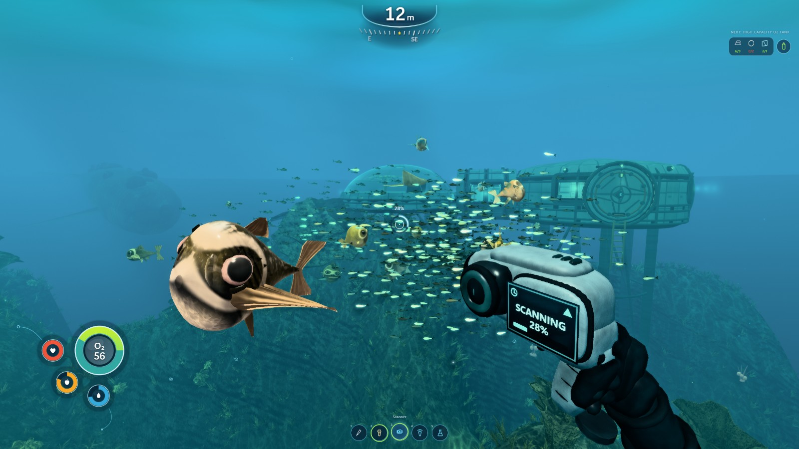
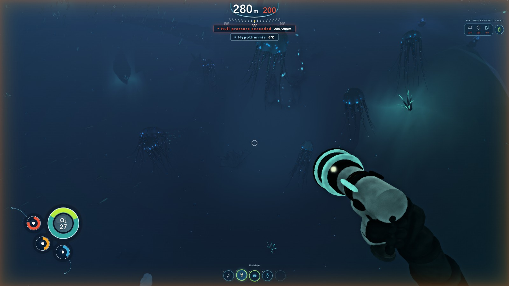
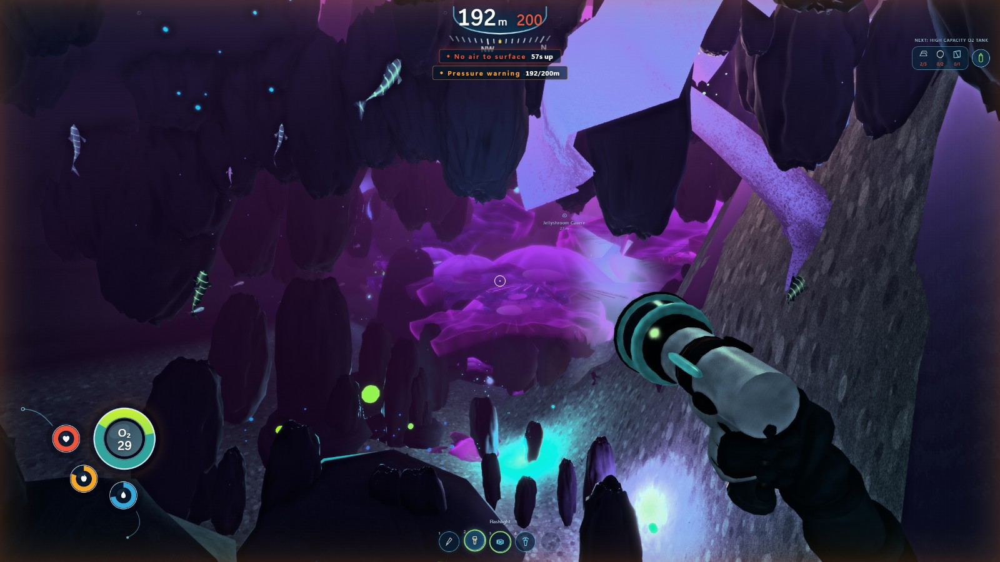
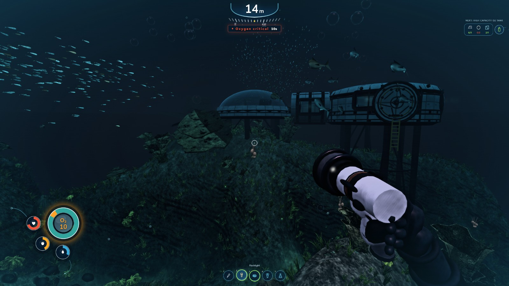

# ClaudeNautica

**A procedural underwater survival game in the browser — three.js / WebGL2, no binary assets, ~35 rounds of an automated builder-and-critic loop that judged every frame against real Subnautica screenshots.**

Every rock, creature, caustic, cloud and UI element is generated by code. There is not a single texture file, mesh file or audio file in this repository. It boots with `npm run dev`.



---

## The prompt

The entire project came from one message. This is it, verbatim and unedited:

> Build a playable underwater survival game at the visual and experiential level of Subnautica. It should feel like a real, beautiful alien ocean world, with everything at AAA quality - exploration, terrain, biomes, lighting, creatures, atmosphere, movement, survival, vehicles, bases, interiors, UI, effects, and anything else that matters.
>
> Break the goal into the smallest pieces that can be improved and judged independently. For every important piece, fan out a builder subagent and a separate harsh critic with fresh context. /loop on each piece. Critics must inspect the real playable/rendered output, directly compare it with representative real Subnautica gameplay screenshots and footage, blind A/B when possible, identify the biggest remaining gap, and send it back to be improved.
>
> Keep looping until our output wins against the Subnautica reference or I stop the run. Create a simple live HTML progress page in the project and continuously update it as you work, showing what is being built, current status, comparisons, and progress over time.
>
> Fan out subagents and ultracode. /loop until it's utterly perfect. Fan out sub-agents and ultracode.

Everything below is what came out of that.

---

## Screenshots

Real captures from the running game at 2560×1440, downscaled. No touch-ups, no cherry-picked lighting, HUD included.

| | |
|---|---|
|  |  |
| **Grand Reef, 280 m.** Hull pressure exceeded, hypothermia at 6 °C. The jellyfish are geometry, the depth gradient is a per-channel analytic scattering integral. | **Jellyshroom Cavern, 192 m.** Bioluminescence, an alien biome palette, and 57 seconds of air to the surface. |



**Night shallows, 14 m, ten seconds of oxygen left.** Getting the habitat to have a lit face at night — rather than reading as a black cutout — took its own round and its own critic.

---

## How it was built

The loop, run ~35 times:

1. **Split the game into ~18 independently judgeable pieces** — terrain, creatures, flora, water medium, post-processing, the sea surface, sky, vehicles, bases, UI, survival, movement, audio, tools, structures, schooling, biomes.
2. **Fan out a builder per piece**, each owning exactly one file, each forbidden from touching shared core.
3. **Fan out a separate critic per piece** with fresh context, no knowledge of the builder's reasoning, and instructions to be harsh.
4. **Critics measure the rendered output** — real captures through headless Chrome on a real GPU — against reference frames, and A/B blind where a fair comparison exists.
5. Feed the largest remaining gap back in. Repeat.

### The measurement stack

Judging "does this look right" required tools that don't lie:

- **`tools/capture.mjs`** — drives the real game through Playwright + hardware Chrome (ANGLE/D3D11), 18 canonical camera framings, per-shot isolation, shader-link failure detection.
- **`tools/measure.mjs`** — Laplacian pyramid per-octave energy, per-channel clipping, **linear-light** chromaticity.
- **`tools/blind.mjs`** — normalises both sides (identical crop, size, JPEG quality and mtime) so a critic judging "which is the real game" cannot cheat on metadata.
- **`tools/verify.mjs`** — the build gate. Boots the game, renders, fails on shader errors, module failures, empty frames or an fps collapse. Wired to a pre-commit hook.
- **`tools/play.mjs`** — drives real input through six routes (dive, explore, descend, pressure, deep, surface) to test that it is a *game*, not a screenshot.

### What the loop actually found

The single most consistent result of this project was uncomfortable: **the measuring apparatus was wrong more often than the game was.**

Seven times an agent was given an instruction derived from a measurement, refused it, and proved the premise false. Every refusal was upheld. Five came from bugs in the tools above, one from a reference screenshot that turned out to be 35.7% clipped, and one from an ablation flag that didn't ablate the thing it was named after. Examples:

- A metric counted only *luminance* ≥ 250 as clipping, so a window that was **98.63% green-railed** reported "0% clipping" — and a whole round's brief was built on it.
- Chromaticity was computed on means of 8-bit sRGB codes. Because sRGB's `−0.055` offset carries level-dependent weight, a pixel of **exactly constant colour** reports a drifting hue — upward below G/B = 1, downward above it. Our water sits below, the reference above, so the two were biased in *opposite* directions and a "6× gap" was mostly the encoder.
- A vertex shader called `fwidth()`, which is fragment-only. Nothing threw. 34–37 shader programs silently failed to link, every module reported "OK", and an entire round was spent grading a game that wasn't rendering.

`reference/SYSTEMATIC.md` opens with six retraction sections for this reason. The commit log in [HISTORY.md](HISTORY.md) is the full account.

---

## Running it

```bash
npm install
npm run dev          # → http://localhost:5173
```

Click the canvas to lock the mouse.

| Key | Action |
|---|---|
| **WASD** | Swim |
| **Mouse** | Look |
| **Space** | Ascend |
| **C** / **Ctrl** | Descend |
| **Shift** | Sprint (forward only) |
| **E** | Enter / exit vehicle, interact |
| **F** | Flashlight |
| **Q** / right-click | Scanner |
| **Tab** / **P** | PDA |

You can drown, and pressure will kill you below ~200 m.

### Tooling

```bash
node tools/verify.mjs            # build gate — does it actually render?
node tools/capture.mjs --all     # capture the 18-shot battery
node tools/play.mjs --route=dive # drive real input through a play route
node tools/measure.mjs a.png b.png
```

---

## Honest status

This is **not** finished, and it does not beat Subnautica. The last blind A/B was **14/14** — a critic
identified the real game in every fair pair, twelve of them in about a second without magnification.

**The biggest problem is not visual.** Played rather than screenshotted, the game holds ~105 fps and
then freezes for **6 to 9 seconds at a time** while three.js compiles material variants on first draw.
The world has ~94 distinct shader programs and they compile lazily, synchronously, as content streams
in — so exploring somewhere new stalls, and swimming back through it does not.

That defect survived 35 rounds of review because of how it was measured: the capture harness *freezes*
the render loop and steps it manually, so it reports render cost on an already-warm shader set and
never runs the per-frame update path at all. It cheerfully reported 60–130 fps for a build that
freezes for nine seconds. `tools/perfprobe.mjs` now drives the real `requestAnimationFrame` loop and
swims like a player; it is the tool that found this, and four separate fixes for it have been tried
and reverted. The cause is understood; the fix is architectural and still open.

Other known-bad, measured, and queued:

- The **wreck doesn't read as a hull**; creature **eyes are one flat tone**; the **creepvine is black
  origami**.
- The **sea surface** carries no near-to-far chroma ramp — both reference plates move 28–44% in
  linear G/B across the frame and ours moves under 3% — and its foam is hard-edged opaque islands
  where the plate has soft broken crest texture.
- The **seabed has a 45° comb** in it: directional anisotropy of 1.537 on the diagonal against 1.168
  in x/y, where the reference plate reads 1.05–1.25.
- The **torch now genuinely lights the world** (a fix that landed after the screenshots above), but its
  pool term scales the medium's own colour, so turning it on *reduces* hue variety — a fix that broke
  something more important than it repaired.

What does hold up: the water medium and colour response (in linear light its hue-vs-level slope is
within 5% of the reference's), survival, and terrain-hugging movement.

**No human had played it** until well after these screenshots were taken — and the first person who
did found the stall above in under a minute, which no automated critic had caught in 35 rounds. Every
score in this repo came from still frames and automated routes. That is the honest limit of a loop
like this one.

## Reference material

This repository does **not** include the Subnautica screenshots used as reference. Those are copyrighted by Unknown Worlds Entertainment and are not mine to redistribute. The analysis derived from them — `reference/LOOK.md`, `reference/PLATES.md`, `reference/SYSTEMATIC.md` — is included, and names the plates it refers to.

Subnautica is © Unknown Worlds Entertainment. This project is an independent, non-commercial exercise that uses it as a quality target. It is not affiliated with or endorsed by Unknown Worlds.

## Stack

three.js r0.171 · WebGL2 · Vite 6 · Playwright · ES modules, no build step required for development.

Built with [Claude Code](https://claude.com/claude-code).
